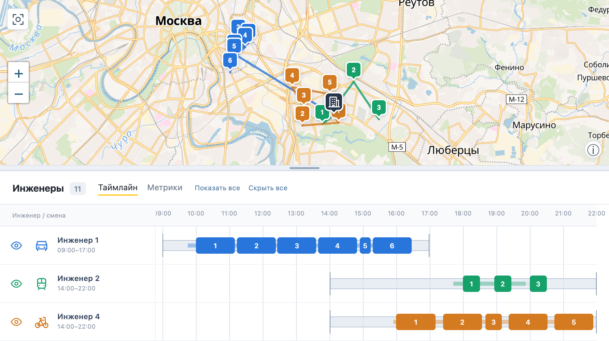
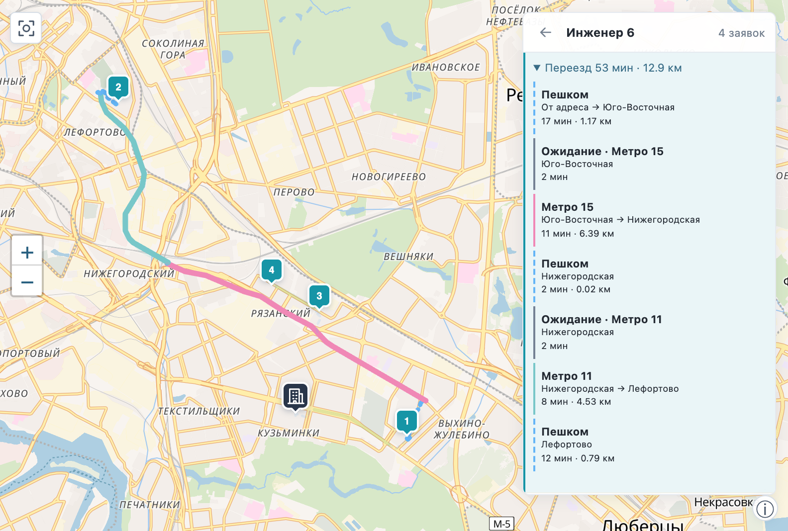

# Выезд — планирование маршрутов инженеров

Сервис для диспетчера выездной службы: распределяет заявки между инженерами, строит маршруты и помогает перестроить рабочий день при изменениях.

**[Открыть приложение →](https://vyezd-158-160-168-189.sslip.io/)**

[Начало работы](#начало-работы) · [Файлы CSV](#файлы-csv) · [Карта и расписание](#карта-и-расписание) · [Перепланирование](#перепланирование) · [Частые вопросы](#частые-вопросы) · [Техническое устройство](#техническое-устройство) · [Локальный запуск](#локальный-запуск)

## Начало работы

1. **Загрузите и проверьте два CSV** во вкладке «План»: [заявки «Восток»](data/samples/Восток.csv) и [инженеров](data/samples/engineers/Инженеры.csv). На GitHub скачивайте файлы кнопкой **Download raw file**. Проверка показывает ошибки строк, но не ищет адреса и не рассчитывает маршруты.
2. **Настройте инженеров:** навыки, транспорт, смены и доступность. Все начинают из офиса заявок. Число доступных сотрудников задаётся файлом; алгоритм определит, сколько из них задействовать.
3. **Нажмите «Рассчитать план».** Если появится окно «Уточните адреса», исправьте точки или исключите заявки и нажмите «Продолжить расчёт». Офис исключить нельзя.
4. **Проверьте карту, таймлайны и метрики.** Неназначенные заявки и причины доступны во вкладке «Заявки». События дня обрабатываются через [перепланирование](#перепланирование).
5. **Откройте «Экспорт плана»:** Excel, печатные маршрутные листы или JSON. В Excel и печатные листы можно включить только выбранные маршруты.

## Файлы CSV

Один набор — один рабочий день и общий офис. Лимиты: **100 заявок, 30 инженеров, 2 МБ на файл**. Поддерживаются UTF-8 и Windows-1251, разделители `;`, запятая и табуляция. ID должны быть уникальными внутри каждого файла. Дата берётся из окон заявок, время — московское.

**Заявки:** обязательны `ID`, `Тип`, `Начало`, `Окончание` и адрес либо обе координаты. В одном файле можно смешивать адресные и координатные строки; координаты задаются в градусах. Последняя строка задаёт офис:

```csv
ID;Тип;Адрес;Начало;Окончание;Широта;Долгота
001;Подключение;Москва, Тверская улица, 1;17.08.2026 10:00;17.08.2026 18:00;;
002;Локальная заявка;;17.08.2026 10:00;17.08.2026 18:00;55.6647568;37.6158385
Адрес офиса;Москва, Театральный проезд, 1
```

Типы: `Подключение`, `Дозаказ`, `Локальная заявка`, `Глобальная проблема`. Для аварии укажите также `Подтип` = `Авария`. Необязательные поля `Длительность, мин`, `Навык`, `Требуемый транспорт` показаны в [полных примерах](data/samples/). Без длительности и навыка применяются нормативы типа работы. Клиентское окно ограничивает начало работы; завершение должно укладываться в смену.

**Инженеры:** обязательны `ID`, `Навыки`, `Транспорт`, `Начало смены`, `Конец смены`; имя необязательно. Смена задаётся как `ЧЧ:ММ` в пределах дня.

```csv
ID;Имя;Навыки;Транспорт;Начало смены;Конец смены
001;Анна;installation | local;Автомобиль;09:00;17:00
002;Борис;emergency;Общественный транспорт;14:00;22:00
```

Навыки: `installation` — подключения и дозаказы, `local` — локальные работы, `emergency` — аварии; от одного до трёх через `|`. Транспорт: `Автомобиль`, `Пешеход`, `Велосипед`, `Общественный транспорт`. Отдельные адреса старта инженеров не задаются.

## Карта и расписание

Слева — вкладки «План», «Заявка», «Заявки», «Инженеры»; снизу — «Таймлайн» и «Метрики». Боковую и нижнюю панели можно растягивать. На смартфоне вкладки расположены над картой.

- **Глазик** скрывает маршрут и точки инженера без изменения плана. Отдельный переключатель скрывает неназначенные заявки.
- **Имя инженера** открывает детальный маршрут; «Показать все» возвращает обзор. В обзоре точки соединены прямыми линиями, в деталях показан рассчитанный путь.
- **Наведение на маршрут или таймлайн** выделяет инженера. Клик по линии приближает маршрут и закрепляет выделение; Escape снимает его.
- **Клик по заявке** открывает карточку слева: исполнитель, прибытие, дорога, ожидание и причина неназначения. Кнопка «Показать на карте» приближает точку; «Отменить заявку» запускает перепланирование.

Цвет связывает инженера с маршрутом и расписанием. Таймлайн показывает работу, переезды и ожидание; метрики — число заявок, время, расстояние и выданное оборудование.



В детальном маршруте клик по переезду выделяет весь путь до заявки и раскрывает описание справа. Общественный транспорт включает пешие участки, ожидание, поездки по линиям и пересадки.



## Перепланирование

Добавьте работу во вкладке **«Заявка»**, отмените её в **«Заявках»** или нажмите **«Сделать недоступным»** в списке инженеров. Укажите время события: по нему определяется, какие выезды уже начались и должны сохраниться. Начатый выезд отменить нельзя; у недоступного инженера переназначаются только будущие работы.

| Режим | Что меняется |
| --- | --- |
| **Разрешить перестановки** — по умолчанию | Будущие исполнители, порядок визитов и время; рассматриваются также ранее неназначенные заявки. Солвер учитывает стабильность расписания после приоритетов обслуживания. |
| **Сохранить расписание** | У доступных инженеров сохраняются исполнители и порядок прежних заявок; новые и освобождённые работы вставляются между ними. Сдвиг позже — в заданном допуске, по умолчанию 15 минут. Прежний неназначенный остаток не включается. |

В обоих режимах сохраняются состав смены, начатые выезды и выданное оборудование; новых людей на смену не вызывают. Прежнее обещанное начало не переносится раньше, клиентские окна и смены остаются обязательными. Оборудование между инженерами автоматически не передаётся.

Нажмите **«Рассчитать вариант»**, проверьте изменения и выберите **«Принять вариант»** или **«Отклонить вариант»**. Принятие сохраняет просмотренный результат без повторного расчёта. Пока предложение открыто, другие события заблокированы. Приоритет новой заявки зависит от вида работы: её добавление само по себе не делает её аварийной.

## Частые вопросы

- **Адрес не найден.** В окне уточнения выберите подтверждённый дом из подсказок и проверьте точку на карте либо задайте координаты. Исправления сохраняются для следующих загрузок. Если точку уточнить нельзя, исключите заявку.
- **Заявка не назначена.** Откройте её карточку: проверьте навыки, транспорт, оборудование и доступное время. Корректный CSV не гарантирует назначения всех работ; причина относится к найденному плану.
- **Расчёт долго идёт.** Проверьте текущий этап. Маршрутизация рассчитывает поездки между точками; процент отражает выполненную работу, а не оставшееся время. Каждый новый запуск строит поездки заново.
- **После перезагрузки виден старый план.** Восстанавливается последний принятый день. Проверка CSV и отклонение варианта его не заменяют; новый план появляется после успешного расчёта или принятия предложения.

## Техническое устройство

| Компонент | Технологии и назначение |
| --- | --- |
| Интерфейс и карта | **React, TypeScript, Vite, Leaflet, MapLibre GL**; подложка OpenFreeMap на данных OpenStreetMap |
| Backend | **Python, FastAPI, Pydantic** — API, входные данные, управление расчётами |
| Дороги | Локальный **Valhalla** по OpenStreetMap: автомобиль, ходьба, велосипед |
| Общественный транспорт | Граф линий Москвы и пересадок; поиск Дейкстры с ограничением ходьбы на **C++**, эталон на Python/NetworkX |
| Распределение | Эвристический солвер **C++20**, независимый Python-checker |
| Адреса | **Photon** — геокодирование; **DaData** — подсказки и уточнение |
| Хранение и экспорт | **SQLite** — планы и история; **openpyxl** — Excel; печатные листы и JSON |

### Маршруты и матрицы

Маршрутизаторы определяют путь между адресами. Для каждого транспорта результаты собираются в **матрицу времени и расстояния**: строка — откуда, столбец — куда. Солвер использует эти значения для проверки переездов в расписании; карта показывает геометрию тех же поездок.

Кеш поездок работает только внутри одного планирования или перепланирования. Сохранённые поездки служат истории и отображению, но не ускоряют новый расчёт. Дорожные и транспортные графы при этом могут оставаться загруженными.

### Как работает солвер

Солвер определяет, **кому назначить заявки и в каком порядке их выполнить**, с учётом навыков, окон, смен, транспорта и оборудования.

1. **Исходный план:** Python baseline последовательно назначает заявки подходящим инженерам.
2. **Несколько стартов:** C++ перебирает позиции вставки, включая *regret-вставку* — учитывает приоритет, нехватку исполнителей и стоимость альтернатив.
3. **Улучшение:** локальные переносы и обмены; *LNS / destroy–repair* снимает часть назначений и собирает их заново.
4. **Проверка:** независимый Python-checker проверяет расписание, ограничения и метрики перед сохранением.

Приоритеты: обслуживание аварий → подключений → остальных работ; затем число инженеров утром или стабильность назначений при перепланировании, задержки аварий и транспортные затраты. Поиск возвращает лучший найденный допустимый план в пределах бюджета, без гарантии глобального оптимума.

Время поездок оценочное: без пробок, точных отправлений и оперативных закрытий. Покрытие ограничено подготовленной сетью. Статусы отражают план, а не подтверждённое выполнение работ. Примеры и скриншоты используют синтетические данные.

## Локальный запуск

Нужны **Python 3.12+, Node.js 22.12+, Make и C++20**. Для загрузки заявок положите предоставленный для кейса `Нормативы.xlsx` в корень. Для реальных поездок нужны подготовленные дорожный, велосипедный и транспортный графы по путям из [config/routing.json](config/routing.json). Нормативы и графы в Git не входят; команды ниже их не создают. Скрипты подготовки находятся в [scripts/](scripts/).

Из корня репозитория:

```bash
python3.12 -m venv .venv
source .venv/bin/activate
python -m pip install -r requirements-routing.lock
python -m pip install -e . --no-deps
make solver
npm --prefix frontend ci
npm --prefix frontend run build
python -m uvicorn dispatch.api:app --host 127.0.0.1 --port 8000
```

Интерфейс: http://127.0.0.1:8000, API: http://127.0.0.1:8000/docs. Для разработки добавьте backend-флаг `--reload` и запустите `npm --prefix frontend run dev` во втором терминале; интерфейс откроется на http://127.0.0.1:5173.

Для подсказок DaData задайте `DADATA_API_KEY` на сервере либо в локальном `.env.local`, исключённом из Git. Ключ в браузер не передаётся. Без него подсказки используют локальный справочник.

Проверки: `make test` и `npm --prefix frontend run build`. Интеграционным тестам дополнительно нужен исходный `Обезличивание.zip`; тесты не вызывают живые картографические API.
